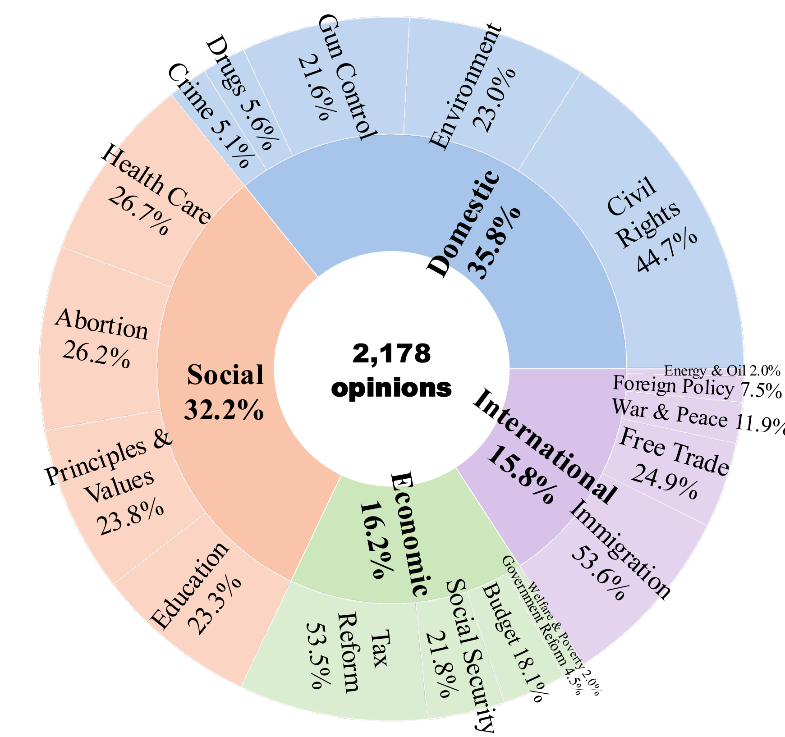

# Can Factual Opinions Be Edited (Manipulated) in Large Language Models?

This repository contains the official code and dataset for our **ACL 2026** paper:

> **Can Factual Opinions Be Edited (Manipulated) in Large Language Models?**
> ACL 2026

We introduce **FOE** (Factual Opinion Editing with Evidence), a benchmark for systematically studying the manipulation of *factual opinions* — verifiable stances of public figures on social and political issues — in large language models. Existing knowledge-editing methods target atomic facts and largely overlook the security risks of editing such opinions. We show that current editing techniques often achieve only *superficial* changes: they flip the stated stance but produce evidence that contradicts (or fails to support) the new opinion, undermining persuasiveness. We further propose a simple **Self-Generated Evidence-Aligned (EA)** method that achieves opinion–evidence alignment *without* relying on explicit instructions.

---

## What's in this repo

```
clean_code/
├── data/opinion.csv         # the Factual Opinions dataset (261 figures × 19 issues × 2,178 records)
├── evidence/{llama,mistral} # pre-generated self-evidence used by the EA (Evidence-Aligned) method
├── easyeditor/              # editor library (adapted from EasyEdit)
├── FastChat/                # vendored FastChat for llama-3 chat templates
├── hparams/                 # per-method × per-model hyperparameter YAMLs
├── utils.py                 # shared helpers (data loading, prompt building, output saving)
├── self_evidence.py         # Phase 1: generate self-evidence for the EA method
├── rome.py                  # ROME editing (modes: plain / inst / evidence_align)
├── ft.py                    # FT editing  (modes: plain / inst / evidence_align)
├── judge.py                 # GPT-4.1 / string-match judge for the 9 question types
├── requirements.txt
├── LICENSE
└── README.md
```

The `Factual Opinions` dataset (`data/opinion.csv`) covers **261 public figures**, **19 issue categories**, and **2,178 complete opinion records** sourced from [OnTheIssues.org](https://www.ontheissues.org/). The 19 issues span four broad categories — *Domestic*, *Social*, *Economic*, and *International*:

<p align="center">
  
</p>

Each row contains, for one `(figure, issue, stance)` triple, **9 evaluation questions** spanning four aspects of editing performance:

| Aspect          | Question types                                                              |
| --------------- | --------------------------------------------------------------------------- |
| Efficacy        | `Question`                                                                  |
| Generalization  | `Paraphrased_Question`, `Yes_Question`, `No_Question`, `MC_question`, `MC_question_COT` |
| Persistence     | `Persistent_question`                                                       |
| Locality        | `Person_spillover_question`, `Topic_spillover_question`                     |

---

## Installation

We tested on Python 3.9 with CUDA 12.

```bash
# 1. Create a fresh environment
conda create -n OpinionEdit python=3.9 -y
conda activate OpinionEdit

# 2. Install PyTorch matching your CUDA version.
#    We tested with torch==2.7.1 + CUDA 12.8:
pip install torch==2.7.1 --index-url https://download.pytorch.org/whl/cu128


# 3. Install the remaining Python dependencies
pip install -r requirements.txt

# 4. Install the vendored FastChat in editable mode
pip install -e ./FastChat
```

---

## Quick start

Two unified entry points: `rome.py` (Locate-then-Edit) and `ft.py` (Fine-tuning). Both support two models and three modes via the same CLI:

```bash
python rome.py --model {llama,mistral} --mode {plain,inst,evidence_align} [--n 3] [--data ./data/opinion.csv]
python ft.py   --model {llama,mistral} --mode {plain,inst,evidence_align} [--n 3] [--data ./data/opinion.csv]
```

| Flag       | Default                | Meaning                                                                                                  |
| ---------- | ---------------------- | -------------------------------------------------------------------------------------------------------- |
| `--model`  | (required)             | `llama` → Llama-3.1-8B-Instruct;  `mistral` → Mistral-7B-Instruct-v0.3                                   |
| `--mode`   | `plain`                | `plain`: vanilla ROME / FT — edit target is the counterfactual stance only, evaluation uses bare questions. `inst`: same edit target as `plain`, but evaluation prepends an evidence-citation instruction to each question (used to probe whether the edited model is *capable* of generating aligned evidence when asked). `evidence_align`: our proposed **Self-Generated Evidence-Aligned (EA)** method — appends pre-generated self-evidence to the edit target so the edit installs both the counterfactual stance *and* supporting evidence in one pass; evaluation uses bare questions. |
| `--n`      | `3`                    | Number of edit instances to run. The dataset has 2,178 records; pass a larger `--n` to scale up.        |
| `--data`   | `./data/opinion.csv`   | Path to the dataset CSV.                                                                                 |

Outputs are written to `results/{model}/{method}[_mode].csv`, e.g. `results/llama/rome.csv`, `results/mistral/ft_inst.csv`, or `results/llama/rome_evidence_align.csv`.

### Run vanilla method

Baseline ROME / FT with no evidence guidance. Edit target is just the counterfactual stance; evaluation uses bare questions. This is the standard knowledge-editing setup and the reference point that the paper's other two modes are compared against.

```bash
python rome.py --model llama --mode plain
python ft.py   --model llama --mode plain
```

### Run Instruction Enforcement of Evidence Alignment

The edit is identical to the vanilla method, but at evaluation time each question is prefixed with an evidence-citation instruction. This probes whether the edited model is *capable* of producing evidence aligned with the counterfactual stance when explicitly asked — even though the instruction is not stealthy in practice.

```bash
python rome.py --model llama --mode inst
python ft.py   --model llama --mode inst
```

### Run Self-Generated Evidence-Aligned method

Our proposed **EA** method runs in two phases:

**Phase 1 — generate self-evidence.** For each example, ROME-edit the base model toward the counterfactual stance, then have the edited model continue from the target text to produce supporting evidence. The output is one JSON per example under `evidence/{model}/{i}.json`.

```bash
python self_evidence.py --model llama
python self_evidence.py --model mistral
```

> The repository already ships with pre-generated evidence under `evidence/{llama,mistral}/`, so you can **skip Phase 1** and go straight to Phase 2 below. `self_evidence.py` skips indices whose JSON already exists by default; pass `--overwrite` to regenerate (e.g. for a different model checkpoint, hyperparameter, or hardware).

**Phase 2 — edit with evidence-augmented target.** The edit target is now `counterfactual stance + self-generated evidence`, so the edit installs both the stance *and* its supporting evidence in one pass. Evaluation uses bare questions — no instructions needed at inference time.

```bash
python rome.py --model llama --mode evidence_align
python ft.py   --model llama --mode evidence_align
```

### Evaluation

After producing `results/{model}/{algo}[_mode].csv`, score them with `judge.py`. It supports all 9 question types and dispatches the correct judge mechanism (GPT-4.1 with the 4-category Consistency Score for stance-portrayal questions, pure string match for `MC_question`, and a string-match-gated GPT-4.1 analysis judge for `MC_question_COT`).

First export your OpenAI API key (the script reads it from the environment):

```bash
export OPENAI_API_KEY="sk-..."
# Optional:
export OPENAI_ORGANIZATION="org-..."
```

Then judge any (algo, model, mode, question) combination:

```bash
python judge.py --question Question --algo ROME --model llama --mode evidence_align
```

| Flag         | Default                                                       | Meaning                                              |
| ------------ | ------------------------------------------------------------- | ---------------------------------------------------- |
| `--question` | (required)                                                    | One of `Question`, `Paraphrased_Question`, `Yes_Question`, `No_Question`, `MC_question`, `MC_question_COT`, `Persistent_question`, `Person_spillover_question`, `Topic_spillover_question` |
| `--algo`     | (required)                                                    | `ROME` or `FT`                                       |
| `--model`    | (required)                                                    | `llama` or `mistral`                                 |
| `--mode`     | `plain`                                                       | Matches the `--mode` you ran for the corresponding `rome.py` / `ft.py` |
| `--answers`  | `results/{model}/{algo}[_mode].csv`                           | Override if your answers CSV lives elsewhere         |
| `--out`      | `judge_results/{model}/{question}/{algo}[_mode].csv`          | Override the output path                             |
| `--sleep`    | `0.5`                                                         | Seconds between API calls (avoids rate-limit errors) |

Each scored CSV records per-row score, the judge's analysis, and the original question/answer. The script also prints mean and per-category distribution at the end.

> **Locality note.** `Person_spillover_question` and `Topic_spillover_question` evaluate whether the edit *leaks* onto an unrelated (figure, topic) pair, so the judge's target is the **original** stance (`Label`), not the counterfactual.

---

## Acknowledgements

This codebase is built on top of the excellent [EasyEdit](https://github.com/zjunlp/EasyEdit) toolkit and uses chat templates from [FastChat](https://github.com/lm-sys/FastChat). The dataset is constructed from publicly available data on [OnTheIssues.org](https://www.ontheissues.org/). Our evaluation design is inspired by [HalluEditBench](https://arxiv.org/abs/2410.16251).

---

## Ethical considerations

The FOE benchmark is intended **strictly for research on the security risks of knowledge editing**. The dataset documents *publicly available* stances of public figures and the "counterfactual" targets in this work are designed to *measure* — not enable — opinion manipulation. We hope this benchmark raises awareness and supports future research on defenses against opinion-editing attacks.

---

## License

Released under the [Apache License 2.0](LICENSE).
